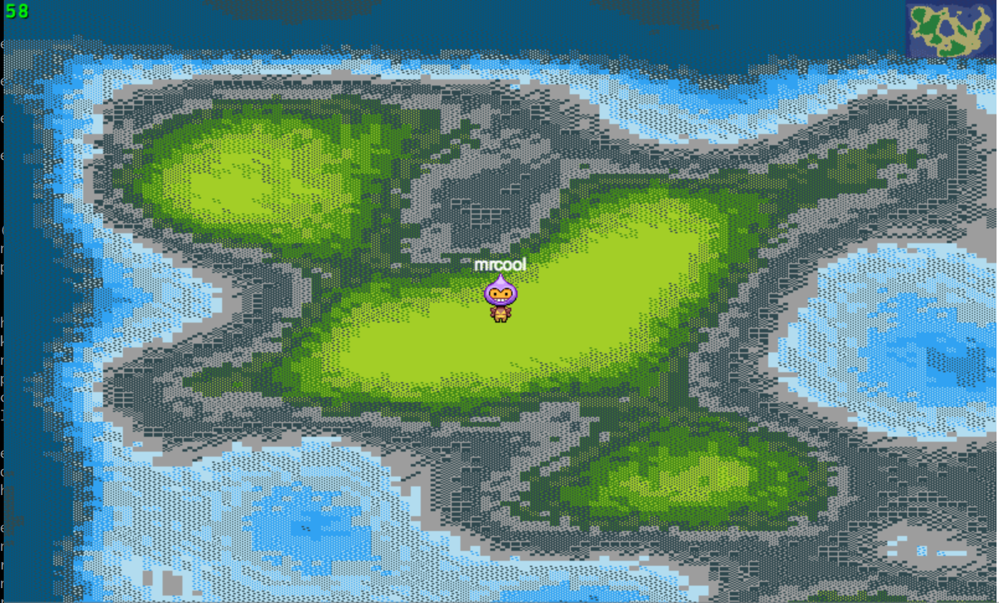

# About

rogue-like with go and phaser.io, using websockets


# Install

```
go get -u github.com/martinlindhe/rogue
```

```
cd $GOROOT/src/github.com/martinlindhe/rouge
go run cli/app/app.go
```

Finally, visit http://localhost:3322


# Screenshot




# License

Under [MIT](LICENSE)
